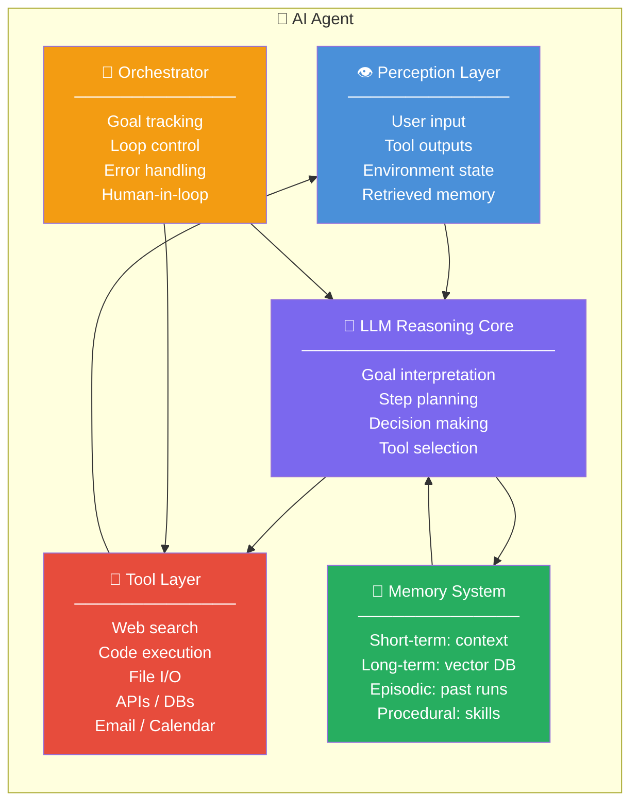

# 🏗️ Agent Architecture 101

> **Phase 1 · Article 3 of 9** | ⏱️ 18 min read | 🏷️ `#theory` `#architecture` `#foundations`

---

## TL;DR

- Every AI agent runs on a **Perceive → Reason → Act → Observe** loop.
- The architecture has five core components: LLM brain, memory, tools, orchestrator, and perception layer.
- Understanding this architecture is the prerequisite to understanding *where* attacks happen — each component is a distinct attack surface.

---

## The Core Loop

Before we look at components, internalize this loop — it's the heartbeat of every agent:

```
  ┌─────────────────────────────────────────────────┐
  │                                                 │
  │       PERCEIVE → REASON → ACT → OBSERVE         │
  │           ↑                         │           │
  │           └─────────────────────────┘           │
  │                      LOOP                       │
  │                                                 │
  └─────────────────────────────────────────────────┘
```

This loop continues until:
- The agent decides the goal is achieved
- A human interrupts it
- It hits an error or resource limit
- An attacker redirects it to a different goal ← (that's a hijacking attack)

---

## The Five Components



---

## Component 1: The Perception Layer

The agent's senses. It receives:

- **User messages** — natural language instructions
- **Tool outputs** — results from APIs, search engines, code execution
- **Retrieved documents** — chunks from vector databases
- **Environment observations** — web page content, file contents, screen state

> ⚠️ **Attack surface**: Everything in the perception layer is *untrusted input*. A malicious web page in the search results, a poisoned document in the knowledge base, or a crafted tool response can all inject instructions into the agent's context.

---

## Component 2: The LLM Reasoning Core

The brain. Takes everything from the perception layer and decides:

1. What is the current goal state?
2. What sub-tasks are needed?
3. Which tool should I call next?
4. What parameters should I pass?
5. Is the goal complete?

The LLM doesn't have persistent state — each "turn" it reads the full context window fresh and reasons from scratch.

```
Context Window at Turn 3:
┌──────────────────────────────────────────────┐
│ [System Prompt]                              │
│   "You are a research agent. Use tools to   │
│    find and summarize information."          │
│                                              │
│ [Turn 1] User: "Research AI safety risks"   │
│ [Turn 1] LLM thought + web_search call      │
│ [Turn 1] Tool result: [search results]      │
│                                              │
│ [Turn 2] LLM thought + read_page call       │
│ [Turn 2] Tool result: [page content]        │
│                                              │
│ [Turn 3] LLM thought: ??? ← reasoning here │
└──────────────────────────────────────────────┘
```

Every line above is read by the LLM. Every line is a potential injection point.

---

## Component 3: Memory Systems

This is one of the most important — and most misunderstood — components. Agents need memory to:

- Maintain context across long tasks
- Remember user preferences
- Store and retrieve knowledge
- Learn from past interactions

| Memory Type | Where Stored | Lifespan | Example |
|-------------|-------------|----------|---------|
| **Working** | Context window | Single session | Current task state |
| **Episodic** | External DB | Persistent | "Last time user asked X, I did Y" |
| **Semantic** | Vector DB | Persistent | Company knowledge base, docs |
| **Procedural** | System prompt | Permanent | "Always format dates as YYYY-MM-DD" |

> ⚠️ **Attack surface**: Long-term memory (vector DB) is persistent and shared. A **memory poisoning attack** plants malicious content here that affects future queries — even from different sessions and different users.

---

## Component 4: The Tool Layer

Tools are how agents interact with the real world. They are the **amplifier** of both capability and risk.

Common tool categories:

```
READ-ONLY TOOLS (lower risk)          ACTION TOOLS (higher risk)
────────────────────────────          ──────────────────────────
🔍 web_search                         📧 send_email
📄 read_file                          💾 write_file
🌐 fetch_url                          💻 execute_code
🗄️ query_database (read)              🗄️ modify_database
📊 get_analytics                      💰 make_payment
                                      🔑 manage_credentials
```

The more action-capable the tool, the higher the blast radius of a compromised agent.

> ⚠️ **Attack surface**: Tools are the mechanism through which an attacked agent causes *real-world harm*. Prompt injection doesn't hurt by itself — but prompt injection + `send_email` tool = data exfiltration. Prompt injection + `execute_code` = remote code execution.

---

## Component 5: The Orchestrator

The conductor. Controls the overall flow:

- Initializes the agent with the goal
- Manages the perception→reason→act loop
- Enforces resource limits (max steps, time limits)
- Decides when to involve a human (Human-in-the-Loop)
- Handles errors and retries

In multi-agent systems, the orchestrator is often itself an LLM agent.

> ⚠️ **Attack surface**: A compromised orchestrator can misdirect all sub-agents. In multi-agent systems, a malicious orchestrator is the most catastrophic attack scenario.

---

## A Concrete Architecture Walkthrough

Let's trace what happens when a user asks a **code review agent** to "find security bugs in this Python file":

```
Step 1 — PERCEIVE
  Input: User message + Python file content
  ↓
Step 2 — REASON (LLM)
  Thought: "I need to analyze this code for security issues.
            I should: 1) Read file, 2) Run static analysis,
            3) Search for known CVEs in dependencies,
            4) Summarize findings"
  Decision: Call read_file tool
  ↓
Step 3 — ACT
  Tool call: read_file("app.py")
  ↓
Step 4 — OBSERVE
  Result: [file contents]
  ↓
Step 5 — REASON (LLM)
  Thought: "File read. I see flask app. Check for SQLi."
  Decision: Call code_analysis tool
  ↓
Step 6 — ACT + OBSERVE
  Tool: code_analysis("check SQL injection")
  Result: "Found: line 47 - unsanitized query"
  ↓
  ... continues ...
  ↓
Step N — REASON
  Thought: "Analysis complete. Summarize findings."
  Output: Full security report → User
```

Each step is a potential attack point. The file itself could contain an injection payload. The code analysis tool could return a poisoned result. The dependency CVE database could be tampered with.

---

## Single-Agent vs. Multi-Agent Architecture

```
SINGLE AGENT                    MULTI-AGENT SYSTEM
────────────                    ──────────────────

User → Agent → Tools            User → Orchestrator Agent
                                            │
                                    ┌───────┼────────┐
                                    ▼       ▼        ▼
                                 Agent   Agent    Agent
                                 (web)  (code)  (report)
                                    │       │        │
                                    └───────┴────────┘
                                            │
                                         Output
```

Multi-agent architectures are more powerful — but multiply the attack surface. Each inter-agent communication channel is a new injection vector.

---

## Attack Surface Map

Here's the full attack surface of this architecture:

```
┌─────────────────────────────────────────────────────┐
│          ATTACK SURFACE OF AN AI AGENT              │
│                                                     │
│  [1] System Prompt         → Leak or override       │
│  [2] User Input            → Direct prompt inject   │
│  [3] Retrieved Documents   → Indirect inject        │
│  [4] Tool Outputs          → Poisoned results       │
│  [5] Long-term Memory      → Memory poisoning       │
│  [6] Inter-agent Messages  → Multi-agent attacks    │
│  [7] Tool Permissions      → Excessive agency       │
│  [8] Model itself          → Backdoor / fine-tune   │
│                                                     │
└─────────────────────────────────────────────────────┘
```

We'll study each of these in Phase 4. This map is your reference.

---

## What's Next?

One component of this architecture — **memory** — deserves its own deep dive.

→ Next: [💾 Memory Systems](./04-memory-systems.md)

---

## Further Reading

- [LangGraph: Agent Architecture](https://langchain-ai.github.io/langgraph/concepts/agentic_concepts/)
- [Cognitive Architectures for Language Agents (2023)](https://arxiv.org/abs/2309.02427)
- [OpenAI: Function Calling](https://platform.openai.com/docs/guides/function-calling)

---

*← [Prev: LLMs as Reasoning Engines](./02-llms-as-reasoning-engines.md) | [Next: Memory Systems →](./04-memory-systems.md)*
