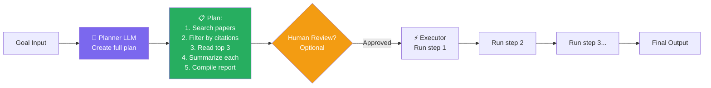

# 🧩 Planning & Reasoning Patterns

> **Phase 1 · Article 6 of 9** | ⏱️ 15 min read | 🏷️ `#theory` `#planning` `#patterns`

---

## TL;DR

- Agents use different **planning patterns** to break down complex goals — each has different trade-offs in capability, predictability, and security.
- **ReAct** (the most common) reasons and acts in tight loops — fast but can be manipulated step by step.
- **Plan-and-Execute** makes a full plan upfront — more predictable, easier to review before execution.
- The more sophisticated the planning, the wider the attack surface for goal hijacking.

---

## Why Planning Patterns Matter for Security

Two agents can have the same tools and the same LLM — but behave completely differently based on their planning pattern.

| Pattern | How it plans | Risk profile |
|---------|-------------|-------------|
| ReAct | One step at a time | Easy to hijack mid-execution |
| Plan-and-Execute | Full plan first, then execute | Plan can be reviewed; harder mid-hijack |
| Tree-of-Thought | Explores many paths | Hard to predict; hard to audit |
| Reflexion | Self-corrects via feedback | Can reinforce injected behavior |

Understanding which pattern your agent uses tells you *how* to attack it (and how to defend it).

---

## Pattern 1: ReAct (Most Common)

**ReAct** = **Re**ason + **Act**. The agent alternates between thinking and doing, one step at a time.

```
Goal: "Find the top 3 AI security papers from 2024 and summarize them"

THOUGHT: I need to search for recent AI security papers.
ACTION:  web_search("top AI security papers 2024")
OBSERVATION: [search results with 10 papers]

THOUGHT: I found 10 papers. I should pick the most cited ones.
         Let me get citation counts.
ACTION:  web_search("citation count: 'Indirect Prompt Injection' 2024")
OBSERVATION: 847 citations

THOUGHT: This paper is highly cited. Read it.
ACTION:  fetch_url("https://arxiv.org/abs/...")
OBSERVATION: [paper abstract + key sections]

THOUGHT: Have 1 of 3. Continue for remaining 2...
... [continues] ...

THOUGHT: I have all 3 papers with summaries. Task complete.
OUTPUT: [formatted summary to user]
```

**Security profile:**
- ✅ Transparent — you can see each step
- ✅ Easy to add step-level controls
- ❌ Vulnerable to mid-execution hijacking (attacker influences one OBSERVATION, derails entire task)
- ❌ Can get stuck in loops if observations are misleading

---

## Pattern 2: Plan-and-Execute

The agent creates a complete plan *before* executing anything.



**Security advantage**: The plan can be shown to a human (or a policy engine) before *any* action is taken. This is the foundation of **Human-in-the-Loop** security design.

**Security weakness**: If the planner LLM is manipulated (via the initial input), the entire plan is corrupted before execution even starts.

---

## Pattern 3: Tree of Thought (ToT)

Instead of a linear chain, the agent explores multiple reasoning branches simultaneously.

```
                    Goal
                      │
          ┌───────────┼───────────┐
          ▼           ▼           ▼
      Branch A    Branch B    Branch C
      (search     (read       (check
       papers)     preprints)  databases)
          │           │           │
      ┌───┴───┐   ┌───┴───┐   ┌───┴───┐
      ▼       ▼   ▼       ▼   ▼       ▼
     A1      A2  B1      B2  C1      C2
      │           │           │
     [best branch selected → continue]
```

**Security implication**: ToT is hard to audit because the agent explores many paths. It's also more expensive (more LLM calls = more attack surface per task).

---

## Pattern 4: Reflexion (Self-Correction)

The agent runs, evaluates its own output, and tries again if it failed.

```
Attempt 1:
  Action → Result → Self-evaluation: "This answer is incomplete"
                                              ↓
Attempt 2:
  Action → Result → Self-evaluation: "Better, but missing X"
                                              ↓
Attempt 3:
  Action → Result → Self-evaluation: "This is correct. Done."
```

**Security risk**: If an attacker can influence the self-evaluation step, they can make the agent keep trying (DoS) or converge on a "correct" answer that serves the attacker.

---

## Pattern 5: LATS (Language Agent Tree Search)

Combines tree search with self-reflection — the agent builds a tree of possible actions, scores each path, and selects the best.

```
State 0 (initial)
    ├─ Action A → State 1a [score: 0.8]
    │                 ├─ Action B → State 2a [score: 0.9] ← Selected
    │                 └─ Action C → State 2b [score: 0.3]
    └─ Action D → State 1b [score: 0.4]
```

Used in code generation and complex planning tasks. More powerful — and harder to secure — than ReAct.

---

## Choosing the Right Pattern (Security Lens)

```
Low risk task, speed matters       → ReAct
                                       (fast, auditable per step)

High stakes, irreversible actions  → Plan-and-Execute + Human review
                                       (see full plan before any action)

Research / exploration tasks       → Tree of Thought
                                       (but log all branches)

Tasks requiring quality assurance  → Reflexion
                                       (but cap max iterations)

Complex optimization tasks         → LATS
                                       (with strict resource limits)
```

---

## The Security-Capability Trade-off

```
  CAPABILITY
      ▲
      │                              LATS ●
      │                     ToT ●
      │            Reflexion ●
      │   Plan-Execute ●
      │ ReAct ●
      └──────────────────────────────────────→
                                         ATTACK SURFACE
```

There's no free lunch. More sophisticated planning = more power = more ways an attacker can interfere.

The right answer is not "use the simplest pattern always" — it's "use the simplest pattern *that meets your requirements*, with appropriate controls."

---

## What's Next?

Single-agent planning is one thing. When multiple agents plan together, complexity (and risk) multiplies.

→ Next: [🕸️ Multi-Agent Systems](./07-multi-agent-systems.md)

---

## Further Reading

- [ReAct: Synergizing Reasoning and Acting in LLMs](https://arxiv.org/abs/2210.03629)
- [Tree of Thoughts: Deliberate Problem Solving with LLMs](https://arxiv.org/abs/2305.10601)
- [Reflexion: Language Agents with Verbal Reinforcement Learning](https://arxiv.org/abs/2303.11366)

---

*← [Prev: Tool Use & Function Calling](./05-tool-use-and-function-calling.md) | [Next: Multi-Agent Systems →](./07-multi-agent-systems.md)*
