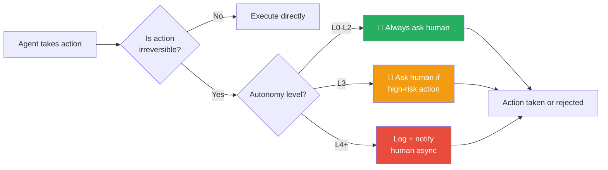

# 📊 Agentic Autonomy Levels

> **Phase 1 · Article 8 of 9** | ⏱️ 12 min read | 🏷️ `#theory` `#autonomy` `#risk`

---

## TL;DR

- Autonomy is a **dial, not a switch** — from fully human-controlled (L0) to fully autonomous (L5).
- Higher autonomy = higher capability AND higher risk. The relationship is not linear — it's exponential.
- Your threat model should start with "what autonomy level is this agent?" — the answer determines which attacks are possible.

---

## The Autonomy Dial

Think of autonomy like cruise control on a car:

```
L0          L1          L2          L3          L4          L5
│           │           │           │           │           │
▼           ▼           ▼           ▼           ▼           ▼
Manual    Assisted   Semi-Auto   Supervised   High-Auto   Full-Auto
────────  ─────────  ──────────  ──────────   ─────────   ─────────
Human     Human      Agent       Agent acts,  Agent acts  Agent
does      steers,    plans,      human        with rare   decides &
all       agent      human       spot-checks  exceptions  acts
work      suggests   approves                             alone
```

---

## Level-by-Level Breakdown

### L0 — Manual
```
┌─────────────────────────────────────────┐
│  HUMAN: Does everything                 │
│  AGENT: Pure advisor / assistant        │
│                                         │
│  Example: "What should I do next?"      │
│  Agent responds, human acts             │
│                                         │
│  Risk: ░░░░░░░░ (Minimal)               │
│  Blast radius: None (agent takes no     │
│  real-world actions)                    │
└─────────────────────────────────────────┘
```

### L1 — Assisted
```
┌─────────────────────────────────────────┐
│  HUMAN: Approves every step             │
│  AGENT: Suggests, drafts, prepares      │
│                                         │
│  Example: Agent drafts email, human     │
│  reviews and hits send                  │
│                                         │
│  Risk: ▒▒░░░░░░ (Low)                   │
│  Attack: Agent could draft malicious    │
│  content hoping human approves blindly  │
└─────────────────────────────────────────┘
```

### L2 — Semi-Autonomous
```
┌─────────────────────────────────────────┐
│  HUMAN: Approves at key checkpoints     │
│  AGENT: Executes multi-step tasks       │
│                                         │
│  Example: Agent plans 10-step research  │
│  task, human approves the plan, agent   │
│  executes all steps                     │
│                                         │
│  Risk: ▓▓▓░░░░░ (Medium)                │
│  Attack: Malicious step hidden inside   │
│  a legitimate-looking plan              │
└─────────────────────────────────────────┘
```

### L3 — Supervised Autonomy
```
┌─────────────────────────────────────────┐
│  HUMAN: Monitors, can intervene         │
│  AGENT: Operates continuously           │
│                                         │
│  Example: Agent manages your email,     │
│  calendar, tasks — human reviews logs   │
│                                         │
│  Risk: ████░░░░ (High)                  │
│  Attack: Prompt injection acts before   │
│  human notices in logs                  │
└─────────────────────────────────────────┘
```

### L4 — High Autonomy
```
┌─────────────────────────────────────────┐
│  HUMAN: Notified of exceptions only     │
│  AGENT: Self-directs toward goals       │
│                                         │
│  Example: Autonomous trading agent,     │
│  DevOps agent that deploys code         │
│                                         │
│  Risk: ██████░░ (Very High)             │
│  Attack: Entire malicious campaigns     │
│  can execute before human aware         │
└─────────────────────────────────────────┘
```

### L5 — Full Autonomy
```
┌─────────────────────────────────────────┐
│  HUMAN: Minimal or no involvement       │
│  AGENT: Self-directing, self-correcting │
│                                         │
│  Example: (Largely theoretical today)  │
│  Agent that manages a full business     │
│  unit end-to-end                        │
│                                         │
│  Risk: ████████ (Extreme)               │
│  Attack: No human in the loop to catch  │
│  compromised behavior                   │
└─────────────────────────────────────────┘
```

---

## Autonomy vs. Attack Impact

```
         POTENTIAL DAMAGE FROM A COMPROMISED AGENT
              │
    Extreme   │                                    ●  L5
              │                              ●  L4
              │                        ●  L3
              │                  ●  L2
     Minimal  │            ●  L1
              │       ●  L0
              └──────────────────────────────────────
                  L0    L1    L2    L3    L4    L5
                           AUTONOMY LEVEL
```

The curve is exponential, not linear. Going from L2 to L3 is a much bigger jump in risk than L1 to L2 — because L3 is the first level where attacks can complete *before* a human can intervene.

---

## The Human-in-the-Loop (HITL) Threshold

The most important security design decision is: **where does your HITL sit?**



**The security rule**: Irreversible, high-blast-radius actions (send money, delete data, send emails, deploy to production) should trigger human approval regardless of the agent's autonomy level.

---

## Matching Autonomy Level to Use Case

| Use Case | Recommended Level | Why |
|----------|------------------|-----|
| Customer service Q&A | L1 | Answers can be wrong; human should verify |
| Research assistant | L2 | Multi-step okay; verify before sharing |
| Code generation | L2–L3 | Review before running in production |
| Automated testing | L3 | Tests are reversible; logs sufficient |
| Email management | L2 | Sending email is irreversible |
| Financial transactions | L1–L2 | Money is always irreversible |
| Infra management | L2–L3 | Prod changes need approval |
| Security monitoring | L3–L4 | Detection okay; response needs human |

---

## Key Takeaway

> **Never grant more autonomy than the task requires.** Every level of autonomy you remove from the human approval loop is a level of blast radius you add to a potential attack.

This is the autonomy version of **Principle of Least Privilege** — and it's one of the most actionable security controls for agentic AI.

---

## What's Next?

Last article in Phase 1 — how do we *see* what agents are doing? Observability before security.

→ Next: [👁️ Agent Observability](./09-agent-observability.md)

---

*← [Prev: Multi-Agent Systems](./07-multi-agent-systems.md) | [Next: Agent Observability →](./09-agent-observability.md)*
