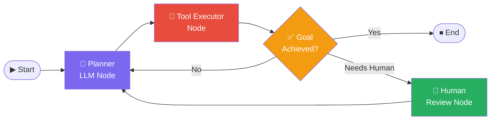

# 🦜 LangChain & LangGraph

> **Phase 2 · Article 1 of 9** | ⏱️ 20 min read | 🏷️ `#framework` `#langchain` `#langgraph` `#in-practice`

---

## TL;DR

- **LangChain** is the most widely used framework for building LLM applications — it provides building blocks for chains, agents, tools, and memory.
- **LangGraph** is LangChain's stateful graph-based orchestration layer — the right tool for complex, multi-step, cyclical agent workflows.
- Both are powerful and widely deployed, which means their security defaults and attack patterns are the ones you'll encounter most in the real world.

---

## The LangChain Ecosystem at a Glance

```
┌─────────────────────────────────────────────────────────────┐
│                   LANGCHAIN ECOSYSTEM                       │
│                                                             │
│  langchain-core      ← primitives: prompts, models, tools  │
│  langchain           ← chains, agents, memory abstractions  │
│  langchain-community ← 3rd party integrations (300+)       │
│  langchain-openai    ← OpenAI-specific bindings            │
│  langchain-anthropic ← Anthropic-specific bindings         │
│                                                             │
│  LangGraph           ← stateful graph orchestration        │
│  LangSmith           ← observability + evaluation          │
│  LangServe           ← deploy chains as REST APIs          │
└─────────────────────────────────────────────────────────────┘
```

LangChain is more like an ecosystem than a single library. This matters for security — a vulnerability in `langchain-community` affects every project that uses it.

---

## Core Concepts

### Chains
A chain is a sequence of LLM calls and tool invocations:

```python
from langchain_anthropic import ChatAnthropic
from langchain_core.prompts import ChatPromptTemplate

llm = ChatAnthropic(model="claude-sonnet-4-6")
prompt = ChatPromptTemplate.from_messages([
    ("system", "You are a helpful assistant."),
    ("human", "{input}")
])

# Chain: prompt → LLM → output
chain = prompt | llm
result = chain.invoke({"input": "What is prompt injection?"})
```

Chains are linear and predictable — easy to reason about, easy to audit.

### Agents
Agents add the decision loop — the LLM decides which tool to call:

```python
from langchain.agents import create_tool_calling_agent, AgentExecutor
from langchain_core.tools import tool

@tool
def web_search(query: str) -> str:
    """Search the web for information."""
    # ... implementation
    return results

agent = create_tool_calling_agent(llm, [web_search], prompt)
executor = AgentExecutor(agent=agent, tools=[web_search])
result = executor.invoke({"input": "Find recent AI security papers"})
```

Agents are non-linear and non-deterministic — harder to reason about, harder to audit.

---

## LangGraph: When Chains Aren't Enough

LangGraph represents agent workflows as **graphs** — nodes are actions, edges are transitions.



```python
from langgraph.graph import StateGraph, END
from langgraph.checkpoint.memory import MemorySaver

# Define state schema
class AgentState(TypedDict):
    messages: list
    goal_achieved: bool

# Build the graph
graph = StateGraph(AgentState)
graph.add_node("planner", planner_node)
graph.add_node("tools", tool_executor_node)
graph.add_node("human_review", human_review_node)

# Add conditional edges
graph.add_conditional_edges("planner", route_decision)
graph.add_edge("tools", "planner")

# Compile with checkpointing (persistent state)
checkpointer = MemorySaver()
app = graph.compile(checkpointer=checkpointer)
```

The key LangGraph feature for security: **interrupt nodes** — places in the graph where execution pauses and waits for human input.

```python
# Add a human-in-the-loop interrupt before dangerous actions
graph.compile(
    checkpointer=checkpointer,
    interrupt_before=["send_email_node", "delete_files_node"]
)
```

This is how you implement HITL (Human-in-the-Loop) in LangGraph — and it's one of the most valuable security controls available.

---

## Security Analysis: LangChain Default Posture

LangChain's philosophy is developer flexibility, not security by default. Key security gaps in vanilla LangChain:

```
DEFAULT SECURITY POSTURE:
──────────────────────────────────────────────────────────────
❌ No input sanitization on user messages
❌ No output validation before tool execution
❌ No tool call logging by default
❌ No rate limiting on tool calls
❌ No HITL gates on irreversible actions
❌ No prompt injection detection
❌ Tool errors exposed in detail (information leakage)
❌ Memory stored in-process (no isolation between sessions)
```

None of these are criticisms of LangChain as a framework — it's not designed to be an opinionated security layer. But developers often deploy it thinking "I'm using a popular framework, it must be secure."

**Security must be added by you, the developer.**

---

## Common LangChain Security Misconfigurations

### Misconfig 1: Unrestricted Tool Access

```python
# ❌ DANGEROUS: Agent has access to everything
tools = [
    ShellTool(),          # Can execute any shell command
    FileSystemTool(),     # Can read/write any file
    RequestsTool(),       # Can call any URL
    PythonREPLTool(),     # Can run any Python code
]
agent = create_tool_calling_agent(llm, tools, prompt)
```

```python
# ✅ SAFER: Scoped, limited tools
tools = [
    WebSearchTool(max_results=5),       # Read-only, rate-limited
    FileReadTool(allowed_paths=["/docs/"]),  # Scoped path
]
```

### Misconfig 2: Exposing Tool Errors to the LLM

```python
# ❌ DANGEROUS: Error details feed back into LLM context
# If a SQL query fails, the error message reveals table names,
# column names, and DB structure — valuable for an attacker
executor = AgentExecutor(agent=agent, tools=tools,
                         handle_parsing_errors=True)  # Exposes errors
```

```python
# ✅ SAFER: Sanitize errors before returning to LLM
def safe_tool_wrapper(tool_fn):
    def wrapped(*args, **kwargs):
        try:
            return tool_fn(*args, **kwargs)
        except Exception as e:
            # Return generic error, not details
            log_error(e)  # Log internally
            return "Tool execution failed. Please try a different approach."
    return wrapped
```

### Misconfig 3: Unsafe Memory Persistence

```python
# ❌ DANGEROUS: All users share the same memory object
from langchain.memory import ConversationBufferMemory
shared_memory = ConversationBufferMemory()  # Global — shared!

# User A's conversation is visible to User B
```

```python
# ✅ SAFER: Per-session, per-user memory with isolation
def get_memory(user_id: str, session_id: str):
    return ConversationBufferMemory(
        memory_key=f"{user_id}:{session_id}"  # Namespaced
    )
```

### Misconfig 4: LangChain Community Package Risk

```python
# ❌ RISKY: langchain-community has 300+ integrations
# Each is a dependency with its own vulnerabilities
from langchain_community.tools import SteamWebAPIQueryRun
from langchain_community.tools import AINAppOps  # Do you know what this does?
from langchain_community.document_loaders import PyMuPDFLoader
```

The community package is a supply chain risk. Audit every integration you import. Check for known CVEs. Pin versions.

---

## LangGraph Security Features

LangGraph provides more security-friendly patterns than basic LangChain agents:

| Feature | Security Benefit |
|---------|-----------------|
| `interrupt_before` | HITL gate before any specified node |
| `interrupt_after` | HITL gate after node executes (inspect before continuing) |
| `MemorySaver` with thread isolation | Each thread_id gets isolated state |
| Graph visualization | Audit the full workflow before deployment |
| Typed state | Predictable state structure reduces injection surface |
| Step-by-step streaming | Observe each step as it happens |

---

## LangSmith: Observability for Security

LangSmith is the observability layer for LangChain. From a security perspective, it's essential:

```python
import os
os.environ["LANGCHAIN_TRACING_V2"] = "true"
os.environ["LANGCHAIN_API_KEY"] = "your-key"
os.environ["LANGCHAIN_PROJECT"] = "production-agent"

# Now every run is automatically traced:
# - Every LLM call with full prompt/response
# - Every tool call with parameters and results
# - Full execution graph with timings
# - Errors and retries
```

This gives you the audit trail needed to detect prompt injection, tool abuse, and anomalous behavior.

---

## Threat Model: LangChain-Specific Attack Vectors

| Attack Vector | How It Manifests in LangChain |
|--------------|-------------------------------|
| Prompt injection | Via `HumanMessage`, retrieved docs, tool outputs |
| Tool abuse | `ShellTool`, `PythonREPLTool` with unrestricted scope |
| Memory poisoning | Writing malicious content to `VectorStoreRetrieverMemory` |
| Chain of thought hijacking | Injecting into `AgentScratchpad` |
| Community package supply chain | Malicious update to `langchain-community` |
| LangServe exposure | Publicly exposed chain endpoints with no auth |

---

## Security Checklist for LangChain/LangGraph Projects

```
BEFORE DEPLOYING:
[ ] Audit every tool in your tool list — do you need it?
[ ] Replace ShellTool and PythonREPLTool with scoped alternatives
[ ] Add interrupt_before for every irreversible action node (LangGraph)
[ ] Enable LangSmith tracing in production
[ ] Scope memory to user/session (no shared global memory)
[ ] Sanitize tool errors before returning to LLM context
[ ] Pin all langchain-* package versions
[ ] Review every langchain-community import for necessity
[ ] Add rate limiting on AgentExecutor (max_iterations)
[ ] Set request timeout on LLM calls
```

---

## Further Reading

- [LangChain Security Documentation](https://python.langchain.com/docs/security)
- [LangGraph Documentation](https://langchain-ai.github.io/langgraph/)
- [LangSmith Observability](https://docs.smith.langchain.com/)
- [LangChain CVE Tracker](https://github.com/langchain-ai/langchain/security/advisories)

---

*← [Phase 2 Index](./README.md) | [Next: AutoGen & CrewAI →](./02-autogen-crewai.md)*
