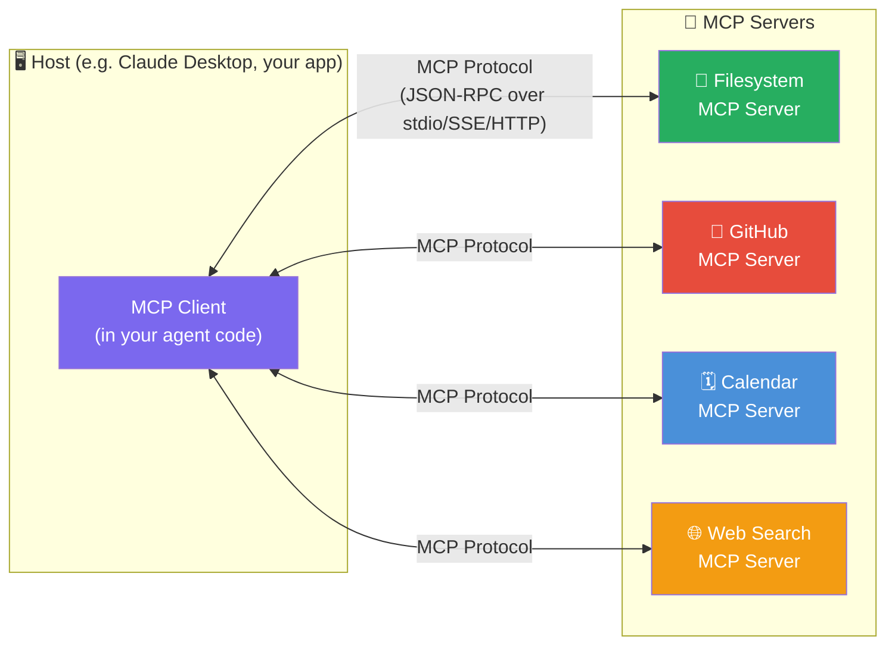

# 🔌 Model Context Protocol (MCP)

> **Phase 2 · Article 4 of 9** | ⏱️ 20 min read | 🏷️ `#framework` `#mcp` `#protocol` `#tools`

---

## TL;DR

- MCP is Anthropic's open standard for connecting AI agents to external tools, data sources, and capabilities — the "USB-C for AI tools."
- It defines a universal interface so any MCP-compatible agent can use any MCP server, regardless of the underlying AI provider.
- MCP is rapidly becoming the dominant tool-connection standard — and its security model is still maturing. Understanding it deeply is essential.

---

## The Problem MCP Solves

Before MCP, every AI framework had its own way to define and call tools:

```
LangChain tools:  @tool decorator + JSON schema
OpenAI tools:     tools[] array in API call
Anthropic tools:  tools[] array in API call
AutoGen tools:    register_for_llm() decorator
CrewAI tools:     BaseTool class inheritance

Result: A GitHub MCP server built for LangChain
        doesn't work with AutoGen.
        A Slack tool for OpenAI doesn't work with Claude.
        Every integration is custom.
```

MCP standardizes this:

```
With MCP:
  One GitHub MCP server → works with Claude, GPT-4, Gemini, any agent
  One Slack MCP server  → works with everything
  Build once, use everywhere
```

---

## Architecture: The MCP Model



The **host** (your application or Claude Desktop) contains an **MCP client** that connects to one or more **MCP servers**. Each server exposes capabilities to the agent.

---

## What MCP Servers Expose

MCP defines three types of capabilities:

### 1. Tools
Actions the agent can invoke — equivalent to function calling:

```json
{
  "name": "create_github_issue",
  "description": "Create a new GitHub issue in a repository",
  "inputSchema": {
    "type": "object",
    "properties": {
      "repo": {"type": "string", "description": "Repository (owner/repo)"},
      "title": {"type": "string", "description": "Issue title"},
      "body": {"type": "string", "description": "Issue body (markdown)"},
      "labels": {"type": "array", "items": {"type": "string"}}
    },
    "required": ["repo", "title"]
  }
}
```

### 2. Resources
Data sources the agent can read:

```json
{
  "uri": "file:///workspace/config.json",
  "name": "Application Config",
  "description": "Current application configuration",
  "mimeType": "application/json"
}
```

Resources are like files or endpoints that the agent can retrieve and inject into its context.

### 3. Prompts
Pre-built prompt templates the agent can use:

```json
{
  "name": "code_review",
  "description": "Perform a thorough security-focused code review",
  "arguments": [
    {"name": "code", "description": "The code to review", "required": true},
    {"name": "language", "description": "Programming language", "required": false}
  ]
}
```

Prompts templates let server authors define high-quality, tested prompts that agents can reuse.

---

## MCP Transport: How Clients and Servers Communicate

MCP supports three transport mechanisms:

```
1. STDIO (Standard I/O)
   ────────────────────
   Server runs as a subprocess.
   Client communicates via stdin/stdout.
   Used by: Claude Desktop, local development
   Security: Process isolation, local only

   Agent Process
   ├── spawn(mcp-server-github)
   ├── write to stdin → server reads
   └── read from stdout ← server writes

2. SSE (Server-Sent Events over HTTP)
   ────────────────────────────────────
   Server runs as an HTTP server.
   Client connects over HTTP.
   Used by: Remote servers, web deployments
   Security: Requires auth, TLS

3. HTTP with Streaming
   ─────────────────────
   Standard HTTP with streaming support.
   Newer transport, used for cloud deployments.
   Security: Full HTTP security model
```

**Security implication of STDIO:** MCP servers running via STDIO have the same OS permissions as the process that spawned them. A malicious STDIO MCP server can access any file the agent process can.

---

## The MCP Handshake

When an agent connects to an MCP server, a capability negotiation happens:

```
Client → Server: initialize {
  protocolVersion: "2024-11-05",
  capabilities: { roots: {}, sampling: {} },
  clientInfo: { name: "claude-desktop", version: "1.0" }
}

Server → Client: initialize_result {
  protocolVersion: "2024-11-05",
  capabilities: { tools: {}, resources: {}, prompts: {} },
  serverInfo: { name: "github-mcp", version: "1.2.0" }
}

Client → Server: initialized (acknowledgement)

Now: Client can list_tools, call_tool, read_resource, get_prompt
```

**Security implication:** The server tells the client its version and capabilities. There's no cryptographic proof that the server is who it claims to be. A man-in-the-middle could intercept this handshake.

---

## Building a Simple MCP Server

Here's what a minimal MCP server looks like (using the Python SDK):

```python
from mcp.server import Server
from mcp.server.stdio import stdio_server
from mcp import types

# Create server instance
server = Server("my-security-tool")

# Register a tool
@server.list_tools()
async def list_tools() -> list[types.Tool]:
    return [
        types.Tool(
            name="scan_for_secrets",
            description="Scan a file for hardcoded secrets like API keys",
            inputSchema={
                "type": "object",
                "properties": {
                    "file_path": {"type": "string"}
                },
                "required": ["file_path"]
            }
        )
    ]

@server.call_tool()
async def call_tool(name: str, arguments: dict) -> list[types.TextContent]:
    if name == "scan_for_secrets":
        file_path = arguments["file_path"]

        # ⚠️ SECURITY: Validate path before reading
        if not is_allowed_path(file_path):
            return [types.TextContent(type="text", text="Access denied")]

        results = scan_file(file_path)
        return [types.TextContent(type="text", text=str(results))]

# Run server
async def main():
    async with stdio_server() as (read_stream, write_stream):
        await server.run(read_stream, write_stream,
                        server.create_initialization_options())
```

Notice the `is_allowed_path()` check — this is the kind of server-side validation that every MCP server should implement but many don't.

---

## The MCP Security Landscape

```
CURRENT SECURITY STATE OF THE MCP ECOSYSTEM (2025):

✅ Protocol has transport security (TLS for HTTP transport)
✅ Official SDK provides basic structure
✅ Anthropic's own MCP servers are well-designed

❌ No central registry or vetting for community servers
❌ No cryptographic signing of tool definitions
❌ No standard for server identity verification
❌ No behavioral sandboxing of server code
❌ Community servers vary wildly in security quality
❌ Tool description injection is an open problem
```

The protocol is sound. The ecosystem is immature. The risk is real.

---

## MCP Configuration Files: A Common Attack Vector

MCP servers are configured in a JSON file (e.g., `~/.config/claude/claude_desktop_config.json`):

```json
{
  "mcpServers": {
    "github": {
      "command": "npx",
      "args": ["-y", "@modelcontextprotocol/server-github"],
      "env": {
        "GITHUB_PERSONAL_ACCESS_TOKEN": "ghp_your_token_here"
      }
    },
    "filesystem": {
      "command": "npx",
      "args": ["-y", "@modelcontextprotocol/server-filesystem",
               "/Users/chandan/Documents"]
    }
  }
}
```

**Security issues with this file:**
1. API tokens stored in plaintext
2. `npx -y` auto-downloads and runs npm packages — supply chain risk
3. Filesystem server path should be as narrow as possible
4. No audit log of which servers were accessed when

**Secure alternative:**
```json
{
  "mcpServers": {
    "github": {
      "command": "/usr/local/bin/mcp-server-github",  // Pinned binary, not npx
      "args": [],
      "env": {
        "GITHUB_TOKEN_FILE": "/run/secrets/github_token"  // File reference, not inline
      }
    }
  }
}
```

---

## MCP in Production: Architecture Patterns

### Pattern 1: Gateway Architecture (Recommended for Production)

```
Agent → MCP Gateway → [Internal MCP Servers]
                   ↘ [External MCP Servers (vetted)]

The gateway:
  - Authenticates the agent
  - Rate limits tool calls
  - Logs all calls with full parameters
  - Validates tool outputs before returning
  - Blocks tool calls that violate policy
```

### Pattern 2: Sidecar per Agent

```
[Agent Pod]
  ├── Agent Container
  └── MCP Sidecar Container  ← Only the sidecar can call external servers
                                Agent calls sidecar (trusted, local)
                                Sidecar validates + calls external server
```

Both patterns add a controlled interception point between the agent and raw MCP servers.

---

## MCP Security Checklist

```
BEFORE INSTALLING AN MCP SERVER:
[ ] Review the server's source code
[ ] Check the npm/pip package for known vulnerabilities
[ ] Pin the version (don't use "latest" or npx -y)
[ ] Review every tool's description for injection patterns
[ ] Verify the server publisher's identity
[ ] Use the minimal permission scope (read-only where possible)

IN PRODUCTION:
[ ] Log all MCP tool calls with full parameters
[ ] Rate limit calls per server per session
[ ] Monitor for unexpected outbound connections
[ ] Never store API tokens inline in config files
[ ] Use a secrets manager for credentials passed to MCP servers
[ ] Regularly audit installed MCP servers for updates/compromises
```

---

## Further Reading

- [MCP Official Documentation](https://modelcontextprotocol.io/)
- [MCP Protocol Specification](https://modelcontextprotocol.io/specification)
- [Awesome MCP Servers](https://github.com/punkpeye/awesome-mcp-servers) — community list (vet before use)
- [MCP Security Considerations](https://modelcontextprotocol.io/docs/concepts/security)

---

*← [Prev: OpenAI & Anthropic SDKs](./03-openai-anthropic-sdks.md) | [Next: A2A Protocol →](./05-agent-to-agent-protocol.md)*
