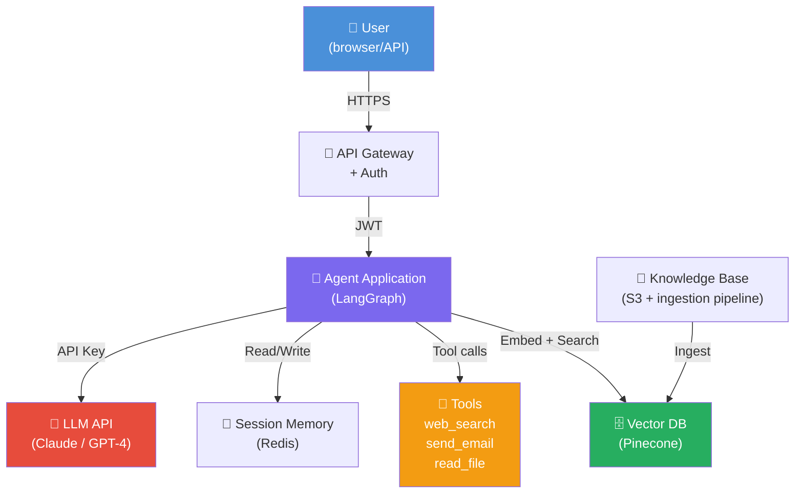

# 🗺️ Threat Modeling for AI Systems

> **Phase 3 · Article 1 of 7** | ⏱️ 20 min read | 🏷️ `#security` `#threat-modeling` `#fundamentals`

---

## TL;DR

- Threat modeling is the structured practice of asking "what can go wrong?" *before* you build, not after you're breached.
- Classical frameworks (STRIDE, PASTA, attack trees) apply to AI — but need significant adaptation for non-deterministic, autonomous systems.
- A good AI threat model maps your architecture, identifies assets, enumerates threats per layer, and produces a prioritized list of controls. **Do this before writing a line of agent code.**

---

## Why Threat Modeling AI Is Different

Classical threat modeling assumes:

```
Traditional software:
  Known inputs → Deterministic logic → Known outputs
  Behavior is fully enumerable at design time
  You can reason about every code path

Agentic AI:
  Natural language inputs → Non-deterministic LLM → Emergent actions
  Behavior depends on runtime context, model temperature, retrieved data
  You CANNOT enumerate all possible behaviors at design time
```

This doesn't make threat modeling *impossible* for AI — it makes it *more important*. You're modeling a system whose behavior you can't fully predict, which means your controls must be more layered and your monitoring more alert.

---

## The Four Questions of Threat Modeling

Every threat model, regardless of methodology, answers four questions:

```
┌─────────────────────────────────────────────────────────────┐
│                                                             │
│  1. WHAT ARE WE BUILDING?                                   │
│     → System diagram, data flows, trust boundaries         │
│                                                             │
│  2. WHAT CAN GO WRONG?                                      │
│     → Threat enumeration (STRIDE / MITRE ATLAS / MAESTRO)  │
│                                                             │
│  3. WHAT ARE WE GOING TO DO ABOUT IT?                       │
│     → Controls, mitigations, acceptance decisions          │
│                                                             │
│  4. DID WE DO A GOOD ENOUGH JOB?                            │
│     → Validation, red-teaming, residual risk review        │
│                                                             │
└─────────────────────────────────────────────────────────────┘
```

Let's walk through each for an AI agent system.

---

## Step 1: Model What You're Building

Start with a diagram. For an AI agent, you need to capture:



**What to capture in your diagram:**
- Every component (LLM API, vector DB, tools, memory stores)
- Every data flow (arrows with protocol and data type)
- Every trust boundary (where one trust zone ends and another begins)
- External entities (users, third-party APIs, MCP servers)
- Data stores (what sensitive data lives where)

---

## Step 2: Identify Your Assets

Assets are what you're protecting. For an AI agent system:

```
HIGH VALUE ASSETS:
────────────────────────────────────────────────────────
💰 User data (PII, financial, health)       → Confidentiality
🔑 API keys & credentials                   → Confidentiality
📄 Proprietary knowledge base               → Confidentiality
🧠 System prompts & business logic          → Confidentiality
⚙️ Agent behavior/decision accuracy        → Integrity
🕐 Service availability                     → Availability
📋 Audit trail / compliance records         → Integrity + Availability

AGENT-SPECIFIC ASSETS:
────────────────────────────────────────────────────────
🎯 Agent goal state (what it's pursuing)   → Integrity
💾 Long-term memory / RAG knowledge base   → Integrity + Confidentiality
🔧 Tool definitions & permissions          → Integrity
📊 Model weights (if self-hosted)          → Integrity + Confidentiality
```

---

## Step 3: Enumerate Threats with STRIDE

**STRIDE** is the classic Microsoft threat taxonomy. Here's how each category maps to AI agents:

| Letter | Threat | Classic Example | AI Agent Version |
|--------|--------|-----------------|------------------|
| **S** | **Spoofing** | Fake login page | Agent impersonation in multi-agent systems |
| **T** | **Tampering** | Modify data in transit | Memory/RAG poisoning; model weight manipulation |
| **R** | **Repudiation** | Deny sending a message | Agent takes action, no audit trail exists |
| **I** | **Information Disclosure** | SQL dump | System prompt extraction; cross-user data leakage |
| **D** | **Denial of Service** | SYN flood | Recursive tool call loops; context window stuffing |
| **E** | **Elevation of Privilege** | SQL → OS | Prompt injection → tool execution → system access |

### Applying STRIDE to Each Component

**On the LLM API connection:**
```
S: Could an attacker intercept and spoof LLM responses?
   → MITM attack on the API call
T: Could responses be tampered with in transit?
   → Modify tool call instructions in response
R: Is there a log of every LLM call with input/output?
   → No log = no repudiation trail
I: Could API key be leaked from environment variables?
D: Could attacker flood LLM API calls to exhaust budget?
E: Could LLM respond with instructions to escalate privileges?
```

**On the Vector DB:**
```
S: Can an attacker inject documents as a trusted source?
T: Can the knowledge base be modified without authorization?
R: Is there a log of who added which documents?
I: Can a user query another user's private documents?
D: Can an attacker flood similarity queries to exhaust DB?
E: Can a malicious document cause the agent to gain new permissions?
```

---

## Step 4: AI-Specific Threat Extensions

STRIDE misses threats unique to AI. Supplement with these categories:

```
PROMPT INJECTION (PI)
  Direct PI:    User input overrides instructions
  Indirect PI:  External content (docs, web, email) overrides instructions
  Stored PI:    Injected instructions persist in memory/RAG

HALLUCINATION THREATS (HA)
  Action on false data: Agent acts on hallucinated facts
  Confident misinformation: High-confidence false output
  Fake tool calls: Agent generates plausible but wrong API calls

NON-DETERMINISM THREATS (ND)
  Inconsistent behavior: Same input, different outcomes
  Temperature exploitation: Attacker exploits randomness
  Emergent behavior: Unintended capability activated

AUTONOMY THREATS (AU)
  Scope creep: Agent expands its own permissions over time
  Goal drift: Agent's objective drifts from original intent
  Recursive self-improvement: Agent modifies its own instructions
```

---

## The MITRE ATLAS Framework

MITRE ATLAS (Adversarial Threat Landscape for Artificial Intelligence Systems) is the AI-specific counterpart to MITRE ATT&CK. It documents real-world adversary tactics, techniques, and procedures (TTPs) for ML systems.

```
ATLAS TACTIC CATEGORIES:
──────────────────────────────────────────────────────────────
Reconnaissance    → Attacker learns about your AI system
                   (model type, training data, capabilities)

Resource Dev.     → Attacker builds attack tools, trains
                   adversarial models

Initial Access    → How attacker first interacts with system
                   (public API, supply chain, physical access)

ML Attack Staging → Attacker prepares ML-specific attacks
                   (adversarial examples, poisoning data)

Model Access      → Attacker gains access to model queries

ML Attack Execution → Executes the attack
                   (inference API attacks, training poisoning)

Exfiltration      → Extracts model or training data

Impact            → Degrades integrity, availability, or
                   causes physical/financial harm
```

ATLAS is a living knowledge base — check [atlas.mitre.org](https://atlas.mitre.org) for the latest techniques.

---

## Step 5: Build the Threat Table

A threat table maps each threat to a component, a control, and a risk level:

| # | Component | Threat (STRIDE) | AI Type | Likelihood | Impact | Risk | Control |
|---|-----------|-----------------|---------|-----------|--------|------|---------|
| 1 | User input | Prompt injection (E) | Direct PI | High | Critical | 🔴 | Input validation + output monitoring |
| 2 | RAG pipeline | Knowledge poisoning (T) | Stored PI | Medium | Critical | 🔴 | Ingestion scanning + source ACL |
| 3 | LLM API | API key leaked (I) | Classic | Low | High | 🟠 | Secrets manager + key rotation |
| 4 | Tool: send_email | Exfiltration (E) | AU | High | Critical | 🔴 | Egress allowlist + HITL |
| 5 | Session memory | Cross-user leakage (I) | Classic | Medium | High | 🟠 | Session namespace isolation |
| 6 | Agent loop | DoS via recursion (D) | ND | Low | Medium | 🟡 | Max step + token limits |
| 7 | System prompt | Extraction (I) | Classic | High | Medium | 🟠 | Confidentiality instruction |
| 8 | MCP server | Supply chain (T) | Classic | Low | Critical | 🟠 | Server vetting + version pinning |

Build this table for your actual system. It becomes your security backlog.

---

## Step 6: Apply the MAESTRO Lens

Once you have your component list, map each component to a MAESTRO layer and enumerate both traditional and agentic threats per layer. (See [MAESTRO Framework](../06-frameworks-and-standards/01-maestro-framework.md) for the full breakdown.)

This is the most AI-specific part of the threat model and shouldn't be skipped.

---

## Step 7: Validate with Red-Teaming

A threat model is a hypothesis. Validation means trying to break the controls you designed:

```
VALIDATION CHECKLIST:
────────────────────────────────────────────────────────────
[ ] Run adversarial prompts against every input surface
[ ] Try to extract the system prompt
[ ] Try indirect injection via each tool's output
[ ] Try to access another user's data
[ ] Try to trigger excessive tool calls (DoS)
[ ] Try to bypass each HITL gate with social engineering
[ ] Test the kill switch — can you actually stop the agent?
[ ] Verify audit logs capture what they should
```

---

## Threat Modeling Anti-Patterns

Things to avoid:

```
❌ "We use GPT-4, it's aligned, so it's secure"
   → Alignment ≠ Security. Aligned models are still injectable.

❌ "Our data is private, no one can poison the RAG"
   → Employees upload documents. APIs ingest data. Supply chain matters.

❌ "We'll threat model after we launch"
   → Retrofitting security is 10x more expensive than designing it in.

❌ "The LLM provider's safety filters protect us"
   → Safety filters protect against harmful content generation.
     They do NOT protect against prompt injection, tool abuse, or data exfil.

❌ "We threat modeled once, we're good"
   → Threat models rot. Every new tool, new model, new feature = new threats.
     Schedule quarterly reviews.
```

---

## AI Threat Modeling Template

```markdown
## AI Agent Threat Model

**System:** [Name and purpose]
**Date:** [YYYY-MM-DD]
**Participants:** [List]
**Next review:** [Date]

### Architecture Diagram
[Insert diagram here]

### Assets
| Asset | Type | Owner | Value |
|-------|------|-------|-------|
| ...   | ...  | ...   | ...   |

### Threat Enumeration
| # | Component | Threat | Category | Likelihood | Impact | Risk | Mitigation |
|---|-----------|--------|----------|-----------|--------|------|------------|
| ...

### MAESTRO Layer Coverage
| Layer | Threats Identified | Controls Designed |
|-------|-------------------|-------------------|
| L1 Foundation Models | ... | ... |
| L2 Data Operations | ... | ... |
...

### Residual Risks (Accepted)
| Risk | Reason Accepted | Owner | Review Date |
|------|----------------|-------|-------------|
| ...

### Red-Team Validation Plan
[List of tests to run]
```

---

## Further Reading

- [MITRE ATLAS: Adversarial Threat Landscape for AI](https://atlas.mitre.org)
- [Microsoft Threat Modeling for AI](https://learn.microsoft.com/en-us/security/engineering/threat-modeling-aiml)
- [NIST AI RMF: Govern, Map, Measure, Manage](https://airc.nist.gov/RMF)
- [OWASP Threat Modeling Cheat Sheet](https://cheatsheetseries.owasp.org/cheatsheets/Threat_Modeling_Cheat_Sheet.html)

---

*← [Phase 3 Index](./README.md) | [Next: CIA Triad in AI →](./02-cia-triad-in-ai.md)*
