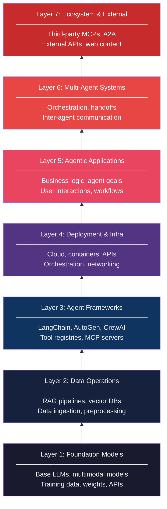

# 🏗️ MAESTRO: The 7-Layer Threat Model for Agentic AI

> **Phase 6 · Article 1** | ⏱️ 20 min read | 🏷️ `#framework` `#threat-modeling` `#maestro`
> **Source:** Cloud Security Alliance (CSA) | **Year:** 2025

---

## TL;DR

- **MAESTRO** (Multi-Agent Environment Security, Threat Risk & Opportunity) is the most comprehensive threat modeling framework specifically designed for agentic AI systems.
- It defines **7 layers** of an agentic AI stack, with a taxonomy of both traditional and agent-specific threats at each layer.
- Use MAESTRO to: systematically identify threats, structure your security architecture, and communicate risk to stakeholders.

---

## What Problem Does MAESTRO Solve?

Before MAESTRO, security teams applying threat modeling to agentic AI had two bad options:

1. **Use STRIDE/PASTA** — designed for traditional software, misses agentic-specific threats entirely
2. **Wing it** — ad-hoc threat lists with no structure, gaps, and no consistency across teams

MAESTRO provides a structured, agentic-specific framework purpose-built for the new threat landscape.

---

## The MAESTRO Philosophy: Two Threat Dimensions

Every layer in MAESTRO is analyzed across two dimensions:

```
┌─────────────────────────────────────────────────────────────┐
│                                                             │
│  TRADITIONAL THREATS          AGENTIC THREATS               │
│  ────────────────────         ──────────────────            │
│                                                             │
│  Security risks inherent      Novel risks arising from:     │
│  to the layer's technology    • Non-Determinism             │
│  (same as any software        • Autonomy                    │
│  system at that layer)        • No Fixed Trust Boundaries   │
│                                                             │
│  Examples:                    Examples:                     │
│  • SQL injection in DB        • Prompt injection via        │
│  • Container escape             retrieved context           │
│  • API auth failures          • Goal hijacking mid-run      │
│  • Supply chain attacks       • Memory poisoning            │
│                               • Multi-agent trust collapse  │
│                                                             │
└─────────────────────────────────────────────────────────────┘
```

---

## The 7 Layers



Think of it as a stack: each layer builds on the one below, and each has its own threat surface.

---

## Layer-by-Layer Breakdown

### Layer 1 — Foundation Models

The base LLM: the weights, training data, and inference API.

```
WHAT'S IN THIS LAYER:
  • Large language models (GPT-4, Claude, Gemini, Llama, etc.)
  • Multimodal models (vision, audio, video)
  • Training data pipeline
  • Fine-tuning infrastructure
  • Model weights and checkpoints

TRADITIONAL THREATS:
  • Training data poisoning (corrupt the dataset)
  • Model extraction (steal weights via API queries)
  • Adversarial examples (inputs that fool the model)
  • Membership inference (identify training data)
  • API key compromise (unauthorized model access)

AGENTIC THREATS:
  • Backdoored models (sleeper agent behavior)
  • Non-deterministic responses enabling probabilistic attacks
  • Emergent capability exploitation
  • Model drift in production affecting agent reliability
  • Cross-modal injection (image → text injection)

KEY DEFENSES:
  • Use models from verified, reputable providers
  • Implement model weight integrity verification
  • Monitor for model behavior drift in production
  • Use differential privacy in fine-tuning on sensitive data
```

---

### Layer 2 — Data Operations

Everything related to how data flows into and supports the agent: RAG pipelines, vector databases, data preprocessing.

```
WHAT'S IN THIS LAYER:
  • Document ingestion pipelines
  • Text chunking and preprocessing
  • Embedding model
  • Vector database (Pinecone, Weaviate, Qdrant, pgvector)
  • Retrieval logic (similarity search, re-ranking)

TRADITIONAL THREATS:
  • Database access control failures
  • Data integrity violations (unauthorized modification)
  • Unencrypted data at rest / in transit
  • SQL/NoSQL injection in data access layer
  • Excessive data retention

AGENTIC THREATS:
  • RAG poisoning (plant malicious documents in KB)
  • Adversarial embeddings (manipulate retrieval rankings)
  • Cross-user context bleed (A's data retrieved for B)
  • Knowledge base enumeration (map internal docs)
  • Retrieval manipulation (craft queries to retrieve specific content)

KEY DEFENSES:
  • RBAC on vector DB (who can read/write which collections)
  • Document provenance tracking + audit log
  • Input scanning at ingestion time
  • Query result sanitization before context injection
  • Tenant isolation in multi-user RAG systems
```

---

### Layer 3 — Agent Frameworks

The frameworks and tools that give agents their capabilities: LangChain, AutoGen, MCP servers, tool registries.

```
WHAT'S IN THIS LAYER:
  • Agent orchestration frameworks (LangChain, AutoGen, CrewAI)
  • Tool/plugin registries
  • MCP server infrastructure
  • Prompt templates and chains
  • Memory management libraries

TRADITIONAL THREATS:
  • Vulnerable dependencies in framework (CVEs)
  • Insecure default configurations
  • Prototype pollution / deserialization attacks
  • Dependency confusion attacks
  • Hardcoded credentials in framework configs

AGENTIC THREATS:
  • MCP poisoning (malicious tool definitions via MCP server)
  • Tool shadowing (malicious tool with same name as legitimate)
  • Insecure tool schemas (injection via description fields)
  • Framework-level prompt injection amplification
  • Untrusted tool result injection

KEY DEFENSES:
  • Vet all MCP servers before installation
  • Pin framework dependency versions
  • Implement tool call monitoring at framework level
  • Separate tool "description plane" from "data plane"
  • Regular security audits of installed plugins/tools
```

---

### Layer 4 — Deployment & Infrastructure

The cloud, containers, networking, and APIs that run the agent in production.

```
WHAT'S IN THIS LAYER:
  • Cloud infrastructure (AWS, GCP, Azure)
  • Container/Kubernetes orchestration
  • API gateway and load balancer
  • Network security groups and firewalls
  • Service accounts and IAM roles
  • Secrets management (API keys, credentials)

TRADITIONAL THREATS:
  • Cloud misconfiguration (public S3 buckets, open security groups)
  • Container escape
  • SSRF (Server-Side Request Forgery)
  • Secrets exposed in environment variables or logs
  • Over-privileged IAM roles
  • Lateral movement in cloud network

AGENTIC THREATS:
  • Over-provisioned agent service accounts (excessive agency at infra level)
  • SSRF via agent URL-fetching tools
  • Agent-triggered crypto mining (resource exhaustion)
  • Agents accessing cloud metadata service (169.254.169.254)
  • Credential exfiltration via agent tool calls

KEY DEFENSES:
  • Principle of least privilege for agent IAM roles
  • Block agent access to cloud metadata endpoints
  • Network egress filtering (allowlist only needed destinations)
  • Secrets in dedicated secret manager (not env vars)
  • Container security scanning
  • VPC isolation for agent workloads
```

---

### Layer 5 — Agentic Applications

The business logic layer: how the agent is designed, what goals it pursues, how it interacts with users.

```
WHAT'S IN THIS LAYER:
  • Agent goal definition and system prompt
  • User interaction design
  • Business logic and decision rules
  • Output formatting and presentation
  • Application-specific tool selection
  • Workflow orchestration logic

TRADITIONAL THREATS:
  • Business logic bypass
  • Insecure direct object reference
  • Privilege escalation via application logic
  • Input validation failures
  • Insecure output handling (XSS in rendered output)

AGENTIC THREATS:
  • Direct prompt injection (goal override via user input)
  • Indirect prompt injection (goal override via retrieved content)
  • System prompt leakage
  • Excessive agency (over-permissioned agent)
  • Agentic loop attacks (infinite recursion)
  • Context window attacks (overflow, stuffing)
  • Data exfiltration via legitimate tools

KEY DEFENSES:
  • Prompt hardening + instruction hierarchy
  • Tool permission scoping (minimal tool set)
  • HITL for irreversible actions
  • Output sanitization and anomaly detection
  • Tool call monitoring + alerting
  • Agent budget limits (tokens, steps, time)
```

---

### Layer 6 — Multi-Agent Systems

How agents communicate, delegate, and coordinate with each other.

```
WHAT'S IN THIS LAYER:
  • Orchestrator-worker relationships
  • Inter-agent message channels
  • Agent identity and authentication
  • Task handoff and delegation protocols
  • Shared memory and state

TRADITIONAL THREATS:
  • Man-in-the-middle on inter-agent channels
  • Message replay attacks
  • Unauthorized agent spawning
  • Resource exhaustion via agent multiplication

AGENTIC THREATS:
  • Rogue orchestrator attack
  • Agent identity spoofing (forge messages from trusted agent)
  • Prompt injection lateral movement between agents
  • Multi-agent trust collapse (no verification of instruction source)
  • Confused deputy (low-privilege agent → high-privilege agent)
  • Shared memory poisoning cascade

KEY DEFENSES:
  • Structured trust levels per agent role
  • Message signing where feasible
  • Input validation on all inter-agent messages
  • Separation of instruction plane from data plane
  • Audit logging of all inter-agent communication
  • Maximum agent spawn limits per session
```

---

### Layer 7 — Ecosystem & External Interactions

Everything outside the system boundary: third-party tools, web content, external APIs, the broader AI ecosystem.

```
WHAT'S IN THIS LAYER:
  • Third-party MCP server ecosystem
  • External web content (pages, APIs)
  • User-submitted content
  • Agent-to-Agent (A2A) interactions with external agents
  • Third-party model providers and APIs
  • Open-source model repositories

TRADITIONAL THREATS:
  • Third-party API compromise
  • Supply chain attacks (malicious npm/PyPI packages)
  • Typosquatting on popular tool names
  • Data exfiltration via third-party services
  • Dependency confusion

AGENTIC THREATS:
  • MCP supply chain compromise (malicious MCP server)
  • Indirect injection via web content
  • Cross-system agent attacks via A2A protocol
  • Prompt injection in third-party API responses
  • Agent impersonation in multi-organization A2A systems
  • Open-source model backdoors (via Hugging Face, etc.)

KEY DEFENSES:
  • Vet all third-party MCP servers and tools
  • Treat all external content as untrusted
  • Implement web content sanitization
  • Restrict outbound connections to allowlisted destinations
  • Monitor and alert on anomalous external data patterns
  • Pin MCP server versions + integrity check on updates
```

---

## Using MAESTRO: A Practical Threat Modeling Session

Here's how to apply MAESTRO to a real system:

```
STEP 1: DEFINE YOUR SYSTEM
  Draw your agent architecture: what components,
  what tools, what data sources, who are the users?

STEP 2: MAP TO LAYERS
  For each component, assign it to a MAESTRO layer.
  Most systems will have components in L1-L5;
  larger systems may use L6-L7.

STEP 3: ENUMERATE THREATS PER LAYER
  For each layer you use, go through:
  a) Traditional threats for that layer's technology
  b) Agentic threats (non-determinism, autonomy, trust)

STEP 4: ASSESS AND PRIORITIZE
  For each threat: Likelihood × Impact = Risk Score
  (Or use AIVSS for formal scoring — see article 6.3)

STEP 5: DEFINE CONTROLS
  For each high/critical threat, define a control.
  Map controls back to specific implementation items.

STEP 6: REVIEW CYCLE
  Repeat when: new tool added, new model deployed,
  new feature launched, new use case enabled.
```

---

## MAESTRO Threat Modeling Template

| Layer | Component | Traditional Threats | Agentic Threats | Controls |
|-------|-----------|--------------------|-----------------|---------:|
| L1 | [Your LLM] | [List] | [List] | [List] |
| L2 | [Your RAG] | [List] | [List] | [List] |
| L3 | [Your Framework] | [List] | [List] | [List] |
| L4 | [Your Infra] | [List] | [List] | [List] |
| L5 | [Your Agent App] | [List] | [List] | [List] |
| L6 | [Your Multi-Agent] | [List] | [List] | [List] |
| L7 | [Your External] | [List] | [List] | [List] |

---

## Key Resources

- **GitHub:** [CloudSecurityAlliance/MAESTRO](https://github.com/CloudSecurityAlliance/MAESTRO)
- **Interactive Tool:** MAESTRO Threat Analyzer (TypeScript/Next.js — run locally)
- **CSA Paper:** Full framework documentation via CSA website

---

## What's Next?

Now that you have a threat framework, you need a scoring system.

→ Next: [🛡️ OWASP LLM Top 10](./02-owasp-llm-top-10.md)

---

*← [Phase 6 Index](./README.md) | [Next: OWASP LLM Top 10 →](./02-owasp-llm-top-10.md)*
