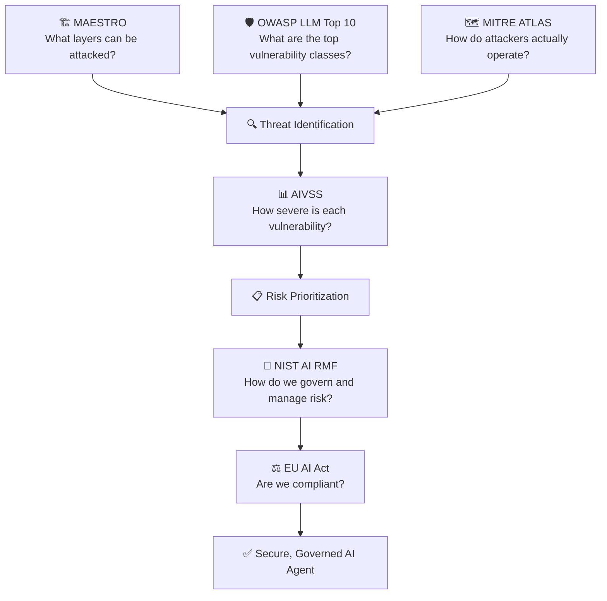

# 📋 Phase 6 — Frameworks & Standards

> **Goal:** Master the formal security frameworks used by industry professionals to analyze, score, and mitigate agentic AI risks.

---

## Articles in This Phase

| # | Article | What It Is |
|---|---------|------------|
| [6.1](./01-maestro-framework.md) | **🏗️ MAESTRO** | CSA's 7-layer threat modeling framework for agentic AI |
| [6.2](./02-owasp-llm-top-10.md) | **🛡️ OWASP LLM Top 10** | The 10 most critical LLM vulnerabilities (2025 edition) |
| [6.3](./03-aivss.md) | **📊 AIVSS** | AI Vulnerability Scoring System — CVSS adapted for AI |
| [6.4](./04-nist-ai-rmf.md) | **📐 NIST AI RMF** | Risk Management Framework for AI systems |
| [6.5](./05-eu-ai-act.md) | **⚖️ EU AI Act** | Compliance requirements and implications for agents |
| [6.6](./06-mitre-atlas.md) | **🗺️ MITRE ATLAS** | Adversarial Threat Landscape for AI Systems |

---

## How These Frameworks Relate

Use these frameworks together — each answers a different question in the risk management lifecycle.
