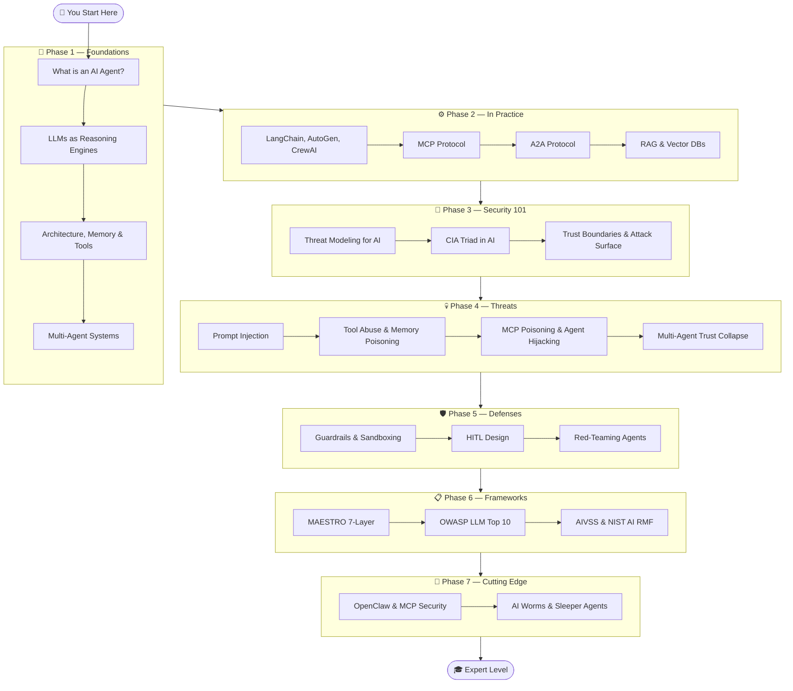

<div align="center">

```
 █████╗  ██████╗ ███████╗███╗   ██╗████████╗██╗ ██████╗
██╔══██╗██╔════╝ ██╔════╝████╗  ██║╚══██╔══╝██║██╔════╝
███████║██║  ███╗█████╗  ██╔██╗ ██║   ██║   ██║██║
██╔══██║██║   ██║██╔══╝  ██║╚██╗██║   ██║   ██║██║
██║  ██║╚██████╔╝███████╗██║ ╚████║   ██║   ██║╚██████╗
╚═╝  ╚═╝ ╚═════╝ ╚══════╝╚═╝  ╚═══╝   ╚═╝   ╚═╝ ╚═════╝
        █████╗ ██╗    ███████╗███████╗ ██████╗
       ██╔══██╗██║    ██╔════╝██╔════╝██╔════╝
       ███████║██║    ███████╗█████╗  ██║
       ██╔══██║██║    ╚════██║██╔══╝  ██║
       ██║  ██║██║    ███████║███████╗╚██████╗
       ╚═╝  ╚═╝╚═╝    ╚══════╝╚══════╝ ╚═════╝
███████╗███████╗ ██████╗██╗   ██╗██████╗ ██╗████████╗██╗   ██╗
██╔════╝██╔════╝██╔════╝██║   ██║██╔══██╗██║╚══██╔══╝╚██╗ ██╔╝
███████╗█████╗  ██║     ██║   ██║██████╔╝██║   ██║    ╚████╔╝
╚════██║██╔══╝  ██║     ██║   ██║██╔══██╗██║   ██║     ╚██╔╝
███████║███████╗╚██████╗╚██████╔╝██║  ██║██║   ██║      ██║
╚══════╝╚══════╝ ╚═════╝ ╚═════╝ ╚═╝  ╚═╝╚═╝   ╚═╝      ╚═╝
```

**From "What is an agent?" to "How do I red-team one?"**
*A complete, open knowledge base on Agentic AI — built in public.*

[](.)
[](.)
[](LICENSE)
[](CONTRIBUTING.md)
[](.)

</div>

---

## 🧭 What Is This?

This repository is a **free, open, structured knowledge base** covering everything about Agentic AI — from the very basics of what an AI agent is, to advanced threat modeling, red-teaming, and security frameworks used by industry experts.

Whether you're a developer building agents, a security engineer defending them, or a curious learner — **there's a path for you here**.

> 💡 **No prerequisites except curiosity.** We build intuition first, then go deep.

---

## 🗺️ Learning Path



---

## 📚 Table of Contents

| Phase | Topic | Articles | Status |
|-------|-------|----------|--------|
| [📘 01](./01-foundations/) | **Foundations of Agentic AI** | 9 | ✅ Complete |
| [⚙️ 02](./02-agentic-ai-in-practice/) | **Agentic AI in Practice** | 9 | ✅ Complete |
| [🔐 03](./03-security-fundamentals/) | **Security Fundamentals** | 7 | ✅ Complete |
| [💀 04](./04-agentic-ai-threats/) | **Agentic AI Threat Taxonomy** | 15 | ✅ Complete |
| [🛡️ 05](./05-securing-agents/) | **Securing Agents** | 12 | ✅ Complete |
| [📋 06](./06-frameworks-and-standards/) | **Frameworks & Standards** | 6 | ✅ Complete |
| [🔬 07](./07-cutting-edge/) | **Cutting Edge** | 10 | ✅ Complete |
| [📖 08](./08-resources/) | **Resources & Reference** | 1 | ✅ Complete |

---

## 🚀 Where to Start

**Complete beginner?** → Start at [What is an AI Agent?](./01-foundations/01-what-is-an-ai-agent.md)

**Know LLMs, new to agents?** → Jump to [Agent Architecture 101](./01-foundations/03-agent-architecture-101.md)

**Security professional new to AI?** → Start at [Security Fundamentals](./03-security-fundamentals/)

**Want attacks first?** → Go straight to [Prompt Injection](./04-agentic-ai-threats/01-prompt-injection-direct.md)

**Framework research?** → See [MAESTRO](./06-frameworks-and-standards/01-maestro-framework.md) or [OWASP LLM Top 10](./06-frameworks-and-standards/02-owasp-llm-top-10.md)

---

## 🔥 Featured Articles

| Article | Why Read It |
|---------|-------------|
| [🤖 What is an AI Agent?](./01-foundations/01-what-is-an-ai-agent.md) | The single best foundation article to start with |
| [💉 Indirect Prompt Injection](./04-agentic-ai-threats/02-prompt-injection-indirect.md) | The most dangerous & underappreciated attack in AI |
| [🏗️ MAESTRO Framework](./06-frameworks-and-standards/01-maestro-framework.md) | Industry's best 7-layer threat model for agents |
| [☠️ MCP Poisoning](./04-agentic-ai-threats/10-mcp-poisoning.md) | Brand new attack surface, almost no one is defending |
| [🔴 Red-Teaming Agents](./05-securing-agents/10-red-teaming-agents.md) | How to attack your own systems before adversaries do |

---

## 🏗️ Article Template

Every article in this repo follows this structure for consistency:

```
TL;DR          — 3-bullet executive summary
Concept        — Plain English explanation
How It Works   — Technical deep dive
Diagram        — Visual (Mermaid / ASCII)
Real Example   — Concrete scenario
Defense        — What to do about it
Further Reading — Links to papers, tools, docs
```

---

## 🤝 Contributing

Found an error? Want to add an article? Know about a new attack?

1. Fork the repo
2. Create a branch: `git checkout -b article/your-topic`
3. Follow the article template above
4. Submit a PR

See [CONTRIBUTING.md](./CONTRIBUTING.md) for details.

---

## 📜 License

MIT License — free to use, share, and build on. Attribution appreciated.

---

<div align="center">

**Built with 🔥 by [Chandan](https://github.com/vchandan27)**
*"Security is not a product, but a process." — Bruce Schneier*

⭐ Star this repo if it helped you | 🐛 Open an issue if something's wrong | 📢 Share it if it's good

</div>
